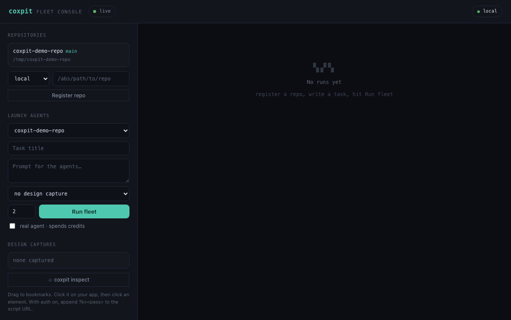
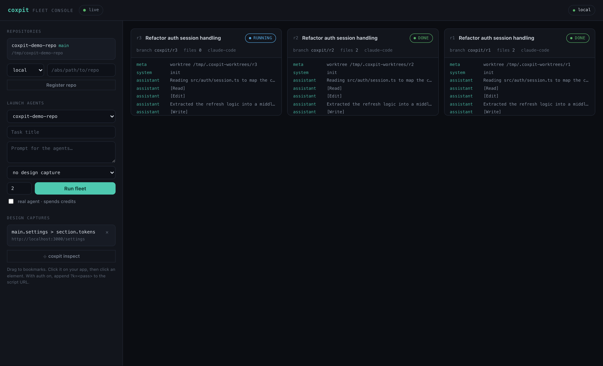
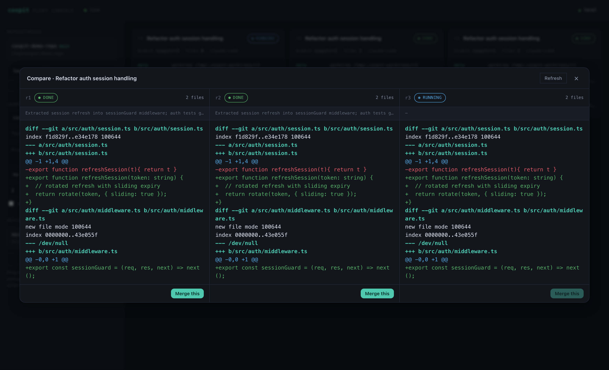

# Coxpit

**Own your agent fleet. Run parallel AI coding agents across your own machines — steer them from any browser.**

**[Landing & downloads](https://hanmariyang.github.io/coxpit-oss/)** · [Latest release](https://github.com/hanmariyang/coxpit-oss/releases/latest)



Coxpit is a self-hosted cockpit for CLI coding agents (Claude Code first). Give it a task and it launches N agents in parallel — each in its own **isolated git worktree**, on its own branch, inside its own tmux session — then streams everything to a live board where you watch, compare diffs side by side, attach a real terminal, and merge the winner.

Your machines. Your auth. Your code never leaves your network.

## What it does

- **Fleet runs** — one task, N agents. Each run = worktree + branch + tmux window. No agent ever touches your checkout.
- **Live board** — WebSocket-driven console: status, event timeline (parsed from the agent's stream-json), per-run diff.
- **Compare & merge** — all runs of a task side by side; pick the winner, merge to the base branch (auto-commits the worktree, guards a clean base, aborts on conflict).
- **Real terminal** — attach to any run's tmux session in the browser (xterm.js over a server-side PTY; resize propagates, `Ctrl-b d` detaches).
- **Multi-machine** — register remote machines over SSH (Tailscale/LAN); probe reachability (git·tmux), run fleets there.
- **Safe stops** — stop kills the whole process group; task close stops and cleans every worktree/branch.
- **Design Mode** — drag the `⌖ coxpit inspect` bookmarklet to your bar, click it on your running app, click any element: its selector, HTML and computed styles are captured and injected into the agents' prompt as design context.

External tools are spawned, never vendored: `git`, `tmux`, your agent CLI. No editor bundled — terminal-first.

| Fleet board | Compare & merge |
|---|---|
|  |  |

## Quickstart

Requirements: Node 20+, git, tmux, an agent CLI on PATH (e.g. `claude`).

```bash
# fastest — straight from npm
COXPIT_AUTH_DISABLED=1 npx coxpit    # → http://127.0.0.1:8210

# or from source
npm install
cp .env.example .env        # set COXPIT_AUTH_PASS (or COXPIT_AUTH_DISABLED=1 locally)
npm run dev
```

Open the board, register a repo (absolute path), write a task, hit **Run fleet**.

By default agents run in **dry-run mode** (a mock that exercises the whole pipeline without spending credits). Flip the "real agent" toggle per launch, or set `COXPIT_AGENT_REAL=1` to default to real.

## Configuration

| env | default | what |
|---|---|---|
| `COXPIT_HOST` / `COXPIT_PORT` | `127.0.0.1` / `8210` | daemon bind |
| `COXPIT_DB` | `./coxpit.db` | SQLite (libSQL) file |
| `COXPIT_AUTH_PASS` / `COXPIT_AUTH_USER` | — / `admin` | basic auth (empty pass = open; set it) |
| `COXPIT_AUTH_DISABLED` | — | `1` disables auth (local dev only) |
| `COXPIT_SSH_KEY` | — | private key for remote machines (else ssh defaults/agent) |
| `COXPIT_AGENT_REAL` | — | `1` = real agent CLI by default (credits!) |
| `COXPIT_AGENT_BIN` | `claude` | agent command |
| `COXPIT_AGENT_PERM` | `acceptEdits` | headless permission mode passed to the agent |

Running on the open internet? Put it behind your own front door (Tailscale, Cloudflare Access, a reverse proxy with TLS) and keep basic auth on — it exposes shells.

## Architecture

```
browser (board · xterm)
   │  HTTP + WS
daemon — Node/TS · Fastify · libSQL(Drizzle)
   │  spawn / ssh
machines — git worktrees · tmux sessions · agent CLIs
```

One daemon, one SQLite file, zero external services. Machines are reached over SSH; the local machine is just `sh`.

## Status

`v2.0` — agent fleet (P1), compare/review + terminal (P2), and Design Mode (P3) are implemented and tested. Roadmap: richer review tooling, more agent providers, packaging (Docker/npm).

## License

MIT
