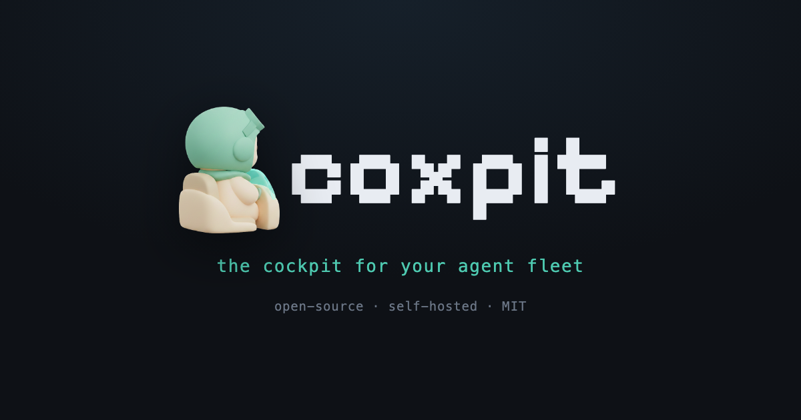

<p align="center"></p>

> 📓 **Build log** · how this was built, on the [AIP Lab blog](https://aiplab.kr/blog/coxpit-fleet.html).

# Coxpit

**Own your agent fleet. Run parallel AI coding agents across your own machines — steer them from any browser.**

**[Landing & downloads](https://hanmariyang.github.io/coxpit-oss/)** · [Latest release](https://github.com/hanmariyang/coxpit-oss/releases/latest)


Coxpit is a self-hosted cockpit for CLI coding agents (Claude Code first). Give it a task and it launches N agents in parallel — each in its own **isolated git worktree**, on its own branch, inside its own tmux session — then streams everything to a live board where you watch, compare diffs side by side, attach a real terminal, and merge the winner.

Your machines. Your auth. Your code never leaves your network.

## What it does

- **Fleet runs** — one task, N agents. Each run = worktree + branch + tmux window. No agent ever touches your checkout.
- **Two providers** — Claude Code and OpenAI Codex CLI, selectable per launch. Fan the same task across both and compare; steering resumes each agent's own session. The provider seam (`src/providers.ts`) is ~100 lines per provider — adding a third is a PR, not a fork.
- **Live board** — WebSocket-driven console: status, event timeline (parsed from the agent's stream-json), per-run diff.
- **Compare & merge** — all runs of a task side by side; pick the winner, merge to the base branch (auto-commits the worktree, guards a clean base, aborts on conflict).
- **Real terminal** — attach to any run's tmux session in the browser (xterm.js over a server-side PTY; resize propagates, `Ctrl-b d` detaches).
- **Multi-machine** — register remote machines over SSH (Tailscale/LAN); probe reachability (git·tmux), run fleets there.
- **Safe stops** — stop kills the whole process group; task close stops and cleans every worktree/branch.
- **Design Mode** — drag the `⌖ coxpit inspect` bookmarklet to your bar, click it on your running app, click any element: its selector, HTML and computed styles are captured and injected into the agents' prompt as design context.
- **Self-orchestrating agents** — every local run can spawn its own sub-agents by writing `.coxpit/spawn.json` in its worktree (works under default permissions — no network, no escalation). The daemon launches each subtask as an isolated sub-run and maintains `.coxpit/subtasks.json` with live status. Orchestration moves inside the agent's own reasoning loop.
- **Start from GitHub** — paste an issue/PR URL and the task form drafts itself from its title and body (gh CLI for private repos, public API otherwise). You review, pick a provider, Run fleet.
- **Start a new project** — point coxpit at an empty (or missing) folder and it runs `git init` + an empty initial commit as the base, then a fleet of agents scaffolds the project in parallel — compare the foundations, merge the one you like onto an empty `main`. Populated folders are never touched.
- **Share a run** — one click mints a read-only snapshot link (timeline + diff, and the rendered docs, no auth, no actions). Show your fleet's work without opening your cockpit.
- **The library** — a run's changed documents (Markdown/HTML) are snapshotted when it settles, so the Rendered view survives merge and Close task. Pick a model per launch (any name your CLI accepts), and a close guard warns before it deletes unmerged, unexported output.
- **Remote access** — one-click Tailscale Serve puts the board on a private `https://<machine>.<tailnet>.ts.net` name (tailnet-only, HTTPS, no port); Funnel (public) is a guarded toggle that refuses to run without a password. No Tailscale? Copy-paste a Cloudflare Tunnel or Caddy reverse-proxy recipe with your port pre-filled. coxpit detects and drives your own tool — it never hosts a relay or bundles tailscale/cloudflared.

External tools are spawned, never vendored: `git`, `tmux`, your agent CLI. No editor bundled — terminal-first.

| Fleet board | Compare & merge |
|---|---|
|  |  |

## Quickstart

Requirements: Node 20+, git, tmux, an agent CLI on PATH (e.g. `claude`).

```bash
# fastest — straight from npm
COXPIT_AUTH_DISABLED=1 npx coxpit    # → http://127.0.0.1:8210

# or from source
npm install
cp .env.example .env        # set COXPIT_AUTH_PASS (or COXPIT_AUTH_DISABLED=1 locally)
npm run dev
```

Open the board, register a repo (absolute path), write a task, hit **Run fleet**.

By default agents run in **dry-run mode** (a mock that exercises the whole pipeline without spending credits). Flip the Dry/Real toggle per launch, or set `COXPIT_AGENT_REAL=1` to default to real.

## First run

Coxpit has no accounts of its own — it drives the agent CLI already on your machine, with that CLI's own login:

1. **Install & sign in to the agent CLI once** (Claude Code by default):
   ```bash
   npm i -g @anthropic-ai/claude-code
   claude        # first run opens browser login
   ```
   For the Codex provider, also: `npm i -g @openai/codex && codex` (sign in once). Other binaries: `COXPIT_AGENT_BIN` / `COXPIT_CODEX_BIN`.
2. **Open the board** — the first-run panel checks this machine (git · tmux · agent CLI) and tells you what's missing.
3. **Rehearse with Dry run**, then flip to Real agent. Real runs spend your CLI account's credits — nothing is billed through coxpit.

Your keys and login never touch coxpit's config or database.

> **New here?** The **[full guide](docs/GUIDE.md)** ([한국어](docs/GUIDE.ko.md)) walks through starting a new project, your first fleet, comparing and merging, doc mode, the terminal, remote access, and every feature — task by task, with GIFs.

## Configuration

| env | default | what |
|---|---|---|
| `COXPIT_HOST` / `COXPIT_PORT` | `127.0.0.1` / `8210` | daemon bind. If the port is busy the daemon **auto-moves to the next free port** (see the startup log / lock file for the actual one) |
| `COXPIT_PORT_STRICT` | — | `1` = fail instead of auto-moving when the port is busy (pin a fixed port behind a reverse proxy) |
| `COXPIT_DB` | `~/.coxpit/coxpit.db` | SQLite (libSQL) file (a legacy `./coxpit.db` in the cwd is still honored) |
| `COXPIT_AUTH_PASS` | — | access key (back-compat, key-only). If set on an **exposed** bind, the branded unlock page asks for this key — no username. Empty = use the stored key, or first-run setup |
| `COXPIT_AUTH_DISABLED` | — | `1` forces auth **off** (delegate to a front gateway like Cloudflare Access / Tailscale) |
| `COXPIT_SSH_KEY` | — | private key for remote machines (else ssh defaults/agent) |
| `COXPIT_AGENT_REAL` | — | `1` = real agent CLI by default (credits!) |
| `COXPIT_AGENT_BIN` | `claude` | Claude Code command |
| `COXPIT_AGENT_PERM` | `acceptEdits` | Claude Code headless permission mode |
| `COXPIT_CODEX_BIN` | `codex` | Codex CLI command (optional second provider) |
| `COXPIT_CODEX_SANDBOX` | `workspace-write` | Codex sandbox policy (`danger-full-access` for full autonomy) |
| `COXPIT_AGENT_ORCH` | on | `0` disables agent self-orchestration (the `.coxpit/spawn.json` protocol + prompt note) |
| `COXPIT_WEBHOOK_URL` | — | POSTs `{event:"run.settled",run:{...}}` when a run finishes — wire it to Telegram, Slack, anything |
| `COXPIT_PUBLIC_URL` | — | if set, the webhook payload adds `url: <base>/?run=<id>` — tap it on your phone and the board opens that run |

Most of these can also be changed from the in-app **Settings** view (gear, left rail) — port, bind host, access key, agent defaults and notification URLs — persisted to `~/.coxpit/settings.json`. Precedence is **explicit env > `settings.json` > default**, so anything pinned by an env var shows as locked in the UI. Port and host changes apply on the next daemon restart.

Running on the open internet? Put it behind your own front door (Tailscale, Cloudflare Access, a reverse proxy with TLS) and keep the access key on — it exposes shells.

## Access key & remote access

Coxpit gates itself with a single **access key** (one owner, no accounts, no username) — but only when it's **exposed**:

- **Loopback bind** (`COXPIT_HOST=127.0.0.1`, the default) is trusted-local: `npx coxpit` on your own machine is zero-friction, no login page, no key.
- **Exposed bind** (`COXPIT_HOST=0.0.0.0` or a routable IP) requires the key. First boot with no key opens a **branded setup page** ("Protect this coxpit — set an access key"). To prove you own the box, setup needs the **one-time setup token** printed to the daemon log (Jupyter-style) — *unless* the request is genuinely local (`http://127.0.0.1` with no proxy in front). A request arriving through a tunnel must use the token, so a stranger hitting a fresh public daemon can't claim it.
- After setup you **unlock once per device** via the same page (session cookie, "Remember this device" = 30 days). No native browser popup — unauthorized API calls just get `401` with no `WWW-Authenticate`.
- **Back-compat:** set `COXPIT_AUTH_PASS` and that value *is* the key — the resident keeps working, now entered on the branded page (no username).
- **Reset the key:** `coxpit reset-key` (or `rm ~/.coxpit/auth.json`) then restart → next boot is first-run setup again.

Front it with **Cloudflare Access** or **Tailscale** for identity on top (set `COXPIT_AUTH_DISABLED=1` to delegate auth entirely to the gateway). The board's Remote access card detects your Tailscale and can put it on `https://<machine>.<tailnet>.ts.net` in one click.

## Platform support

| platform | daemon | agent runs |
|---|---|---|
| macOS / Linux | ✅ first-class | ✅ |
| Windows (WSL2) | ✅ run the daemon inside WSL | ✅ |
| Windows (native) | ⚠️ board + remote machines only | ❌ needs a POSIX shell + tmux |

On Windows, install the daemon inside WSL2 (`npm i -g coxpit`) — WSL2 forwards `localhost`, so the Windows desktop app detects the WSL daemon and attaches to it automatically. A native Windows daemon still serves the board and can drive **remote** (ssh) machines, but the local machine will fail its readiness checks (no tmux).

## Architecture

```
browser (board · xterm)
   │  HTTP + WS
daemon — Node/TS · Fastify · libSQL(Drizzle)
   │  spawn / ssh
machines — git worktrees · tmux sessions · agent CLIs
```

One daemon, one SQLite file, zero external services. Machines are reached over SSH; the local machine is just `sh`.

**One daemon per machine.** Every install method shares `~/.coxpit/` — the daemon takes a lock there (`daemon.lock.json`) and refuses to start if another daemon already owns the database (running two would corrupt each other's live runs). The desktop app checks for a running daemon first and attaches to it (prompting for its basic auth if set); it only spawns its own embedded daemon when none is running. So npm CLI, launchd/systemd service, and the desktop app all see the same machines, tasks, and run history.

## Status

`v4.5` — **greenfield + remote access**. Point Coxpit at an empty folder and a fleet scaffolds a brand-new project across N agents on an empty initial commit — compare the foundations, keep the best (existing folders are never touched). Remote access detects your Tailscale and puts the board on `https://<machine>.<tailnet>.ts.net` in one click (Funnel for public, behind a warning; copy-paste Cloudflare/Caddy recipes otherwise) — Coxpit drives the tool, never hosts a relay. Builds on v4.3's Active-first board + Archive. All shipped and e2e-tested (45 checks). Roadmap: ROADMAP.md.

## Contributing

Issues and PRs are welcome. Start with **[CONTRIBUTING.md](CONTRIBUTING.md)** for
dev setup (`COXPIT_AUTH_DISABLED=1 npm run dev`), the verify gate (`npm run
typecheck` + `bash test/e2e.sh`), and the house rules. Please read the
[non-goals](ROADMAP.md#non-goals) before proposing a feature, and report security
issues privately per **[SECURITY.md](SECURITY.md)** (Coxpit exposes shells).

## License

Coxpit is free and open source under the **AGPLv3 with additional terms** (trademark and
attribution). Use it, run it, modify it. If you run a modified version as a network service,
publish your source. Do not ship a fork under the name "Coxpit".

Releases before 2026-09-02 were MIT and stay MIT. See [LICENSE.md](LICENSE.md).

Icons — [Lucide](https://lucide.dev) (ISC). Paths are inlined as an SVG `<symbol>` sprite (no runtime dependency); the ISC notice is kept in [`licenses/lucide.txt`](licenses/lucide.txt).

Wordmark — [Pixelify Sans](https://github.com/eifetx/Pixelify-Sans) (SIL Open Font License 1.1), self-hosted; the licence is kept in [`licenses/pixelify-sans-OFL.txt`](licenses/pixelify-sans-OFL.txt). The pilot mascot and logo mark are original artwork for this project.
