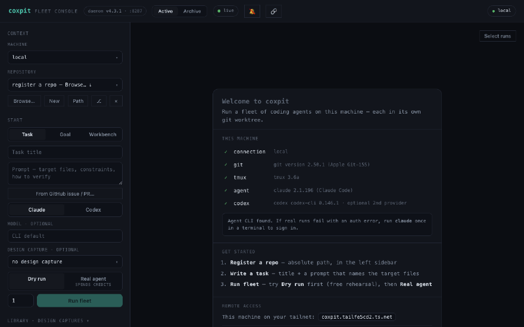
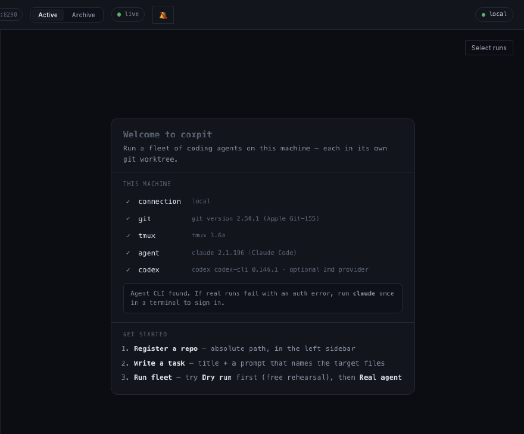
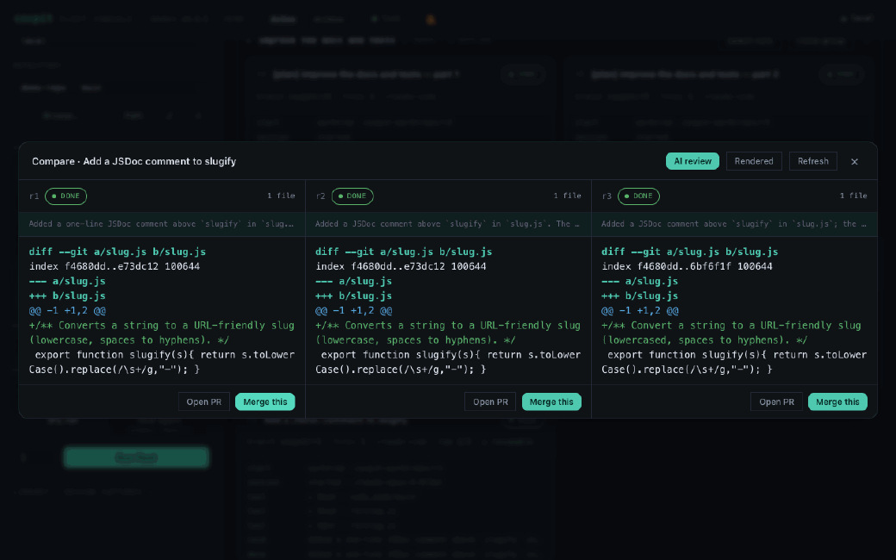
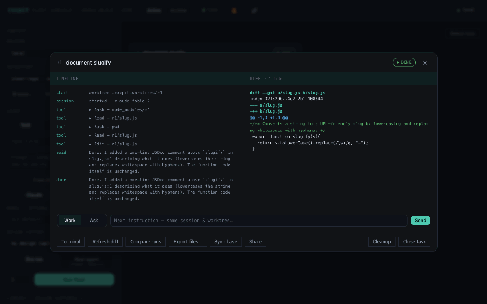
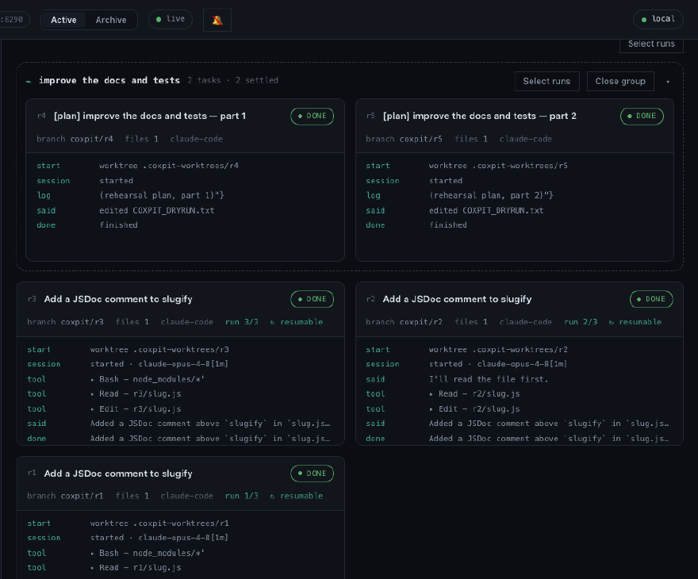
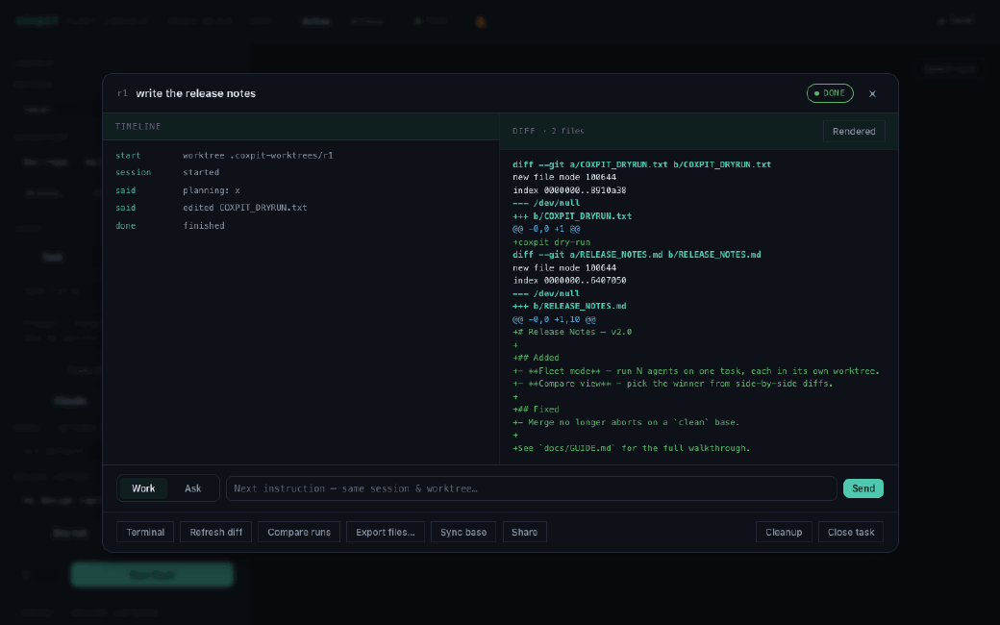
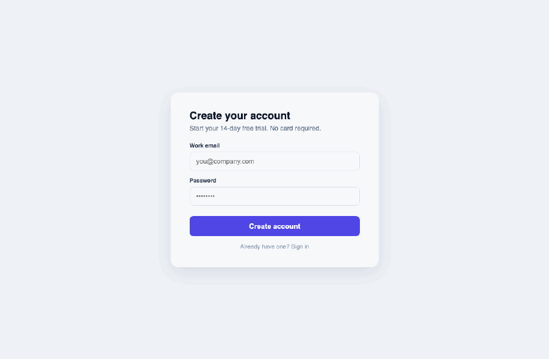

<!-- DRAFT — pending review + the v4.5 remote-access merge (the "Reach it from elsewhere" section
     is written from the spec and will be reconciled once v4.5 lands). Not committed yet. -->

# Coxpit — User Guide

Coxpit runs a **fleet of AI coding agents** on your own machine. You give it a
task; it launches several agents in parallel, each in its own git worktree and
branch, and streams everything to one board in your browser. You watch them
work, compare what they did, and keep the one that got it right.

This guide is task-oriented: skim the first three sections to get going, then
dip into the recipes for whatever you need. The board's own first-run panel
walks you through setup, so this leans on concepts and workflows instead.

**Contents**
- [Install](#install) · [First run](#first-run) · [Your first fleet](#your-first-fleet) · [Pick a winner](#pick-a-winner)
- Recipes: [Two providers](#recipe-two-providers) · [Pick a model](#recipe-model) · [Start a new project](#recipe-greenfield) · [Steer a run](#recipe-steer) · [Swarm](#recipe-swarm) · [Workbench](#recipe-workbench) · [Compare docs, not diffs](#recipe-docs) · [Archive](#recipe-archive) · [Share a run](#recipe-share) · [The terminal](#recipe-terminal) · [Design Mode](#recipe-design) · [Remote machines](#recipe-machines) · [Reach it from elsewhere](#recipe-remote) · [On your phone](#recipe-mobile)
- [How it works](#how-it-works) · [Safety](#safety) · [Troubleshooting](#troubleshooting)

---

## Install

Coxpit is one daemon and one SQLite file. Pick whichever fits you:

```bash
# Fastest — straight from npm, no install
COXPIT_AUTH_DISABLED=1 npx coxpit          # → http://127.0.0.1:8210

# Global CLI
npm i -g coxpit && coxpit

# Docker
docker run -p 127.0.0.1:8210:8210 -v coxpit:/data ghcr.io/hanmariyang/coxpit

# Desktop app (embeds the daemon, opens the board in its own window)
# → download from the landing page, or auto-updates once installed
```

Requirements: Node 20+, `git`, `tmux`, and a coding-agent CLI on your PATH
(Claude Code by default — `claude`). Coxpit drives that CLI with its own login;
your keys never touch coxpit's config or database.

> **Auth is fail-closed.** If you run coxpit without `COXPIT_AUTH_DISABLED=1` and
> without setting `COXPIT_AUTH_PASS`, **every request is rejected (401)** — this
> is deliberate (the daemon exposes shells). For local use, either set a password
> (`COXPIT_AUTH_PASS=…`) or disable auth (`COXPIT_AUTH_DISABLED=1`). The daemon
> warns you at boot if auth is on but no password is set.

---

## First run

Open the board (`http://127.0.0.1:8210`). On an empty board you'll see a **setup
panel** that checks this machine: git, tmux, your agent CLI (and Codex, if
present). Green across the board means you're ready.

Now you need something to work on. There are two ways in — start with the first
if you're beginning a fresh project.

### Start a new project (the easy on-ramp)

Don't have a repo yet? Click **New** in the left **Context** panel. Point it at an
empty (or not-yet-existing) folder and coxpit runs `git init` and makes an empty
initial commit as the base — no setup on your side.



That empty commit is all a fleet needs to branch from. Write a task like
*"scaffold a Next.js + Tailwind app that …"*, run **2–3 agents**, and each builds
the project in its own worktree. Then you [compare the foundations](#pick-a-winner)
and merge the one you like onto `main`. It's the quickest way to *see* what coxpit
does: you go from an empty folder to three real starting points and pick the best.
(Coxpit never touches a folder that already has files.)

### Or register an existing repo

Already have a project? In **Context**, use **Browse…** to pick its folder (git
repos get a badge) or **Path** to type an absolute path. (The repo must have at
least one commit — if it doesn't, coxpit offers to start it as a new project.)

The repo you pick (and the machine above it) is what every launch uses.

---

## Your first fleet

Coxpit ships in **dry-run mode** — a mock agent that exercises the entire
pipeline (worktree → branch → tmux → stream → diff → merge) **without spending
any credits**. Do your first run dry to see the shape of things:

1. In **Start → Task**, give it a title and a prompt.
2. Leave the mode on **Dry run**, set the count to `2` or `3`, hit **Run fleet**.
3. Watch the cards appear.



Each **card** is one run. Reading a card:
- **`rN`** — the run id. **branch** `coxpit/rN` — its isolated branch.
- The **status chip** — pending → running → done (or failed/stopped/merged).
- **files** — how many files it changed. **run i/n** — if a task has several
  runs, which attempt this is.
- The **timeline** — the agent's steps, parsed from its output: `said …`,
  `tool ▸ Edit — file`, `done`.

Click a card to open it: the full **timeline** on the left, the **diff** on the
right. When you're ready, flip the mode to **Real agent** and run again — real
runs spend your CLI account's credits (nothing is billed through coxpit).

---

## Pick a winner

The point of a fleet is choice. Open any run and hit **Compare runs** to see
every attempt for that task side by side:



- **Merge this** — commits the run's worktree and merges its branch into your
  base branch. Guards a clean base; aborts on conflict.
- **Open PR** — pushes the branch and opens a GitHub PR instead (needs `gh`).
- **Export files…** (from the run modal) — copies the changed files out without
  merging, for reports and one-offs.

Not sure which is best? Hit **AI review** in compare: a judge agent reads every
diff and summarizes each approach with a recommendation — so you decide instead
of reading all the code.

When you're done with a task, **Close task** cleans up its worktrees and
branches. Coxpit warns you first if a run has changes that were never merged or
exported, so you don't throw away work.

---

## Recipes

<a id="recipe-two-providers"></a>
### Run the same task on two providers

Coxpit drives **Claude Code** and **OpenAI Codex**. Pick per launch with the
Claude/Codex toggle in the Task panel. Run the same task on each, then compare
the two approaches. Steering (below) resumes each agent in its own session.
(Adding a third provider is ~100 lines in `src/providers.ts` — a PR, not a fork.)

<a id="recipe-model"></a>
### Pick a model per launch

The **model** field under the provider toggle takes any model name your CLI
accepts (empty = the CLI's default). Cheap models for an exploration fleet, a
strong one for the final run. Your last few are remembered. Sub-agents inherit
their parent's model.

<a id="recipe-greenfield"></a>
### Start a new project from scratch

Covered in [First run](#start-a-new-project-the-easy-on-ramp) — it's the
recommended on-ramp. In short: **New** in Context → an empty/missing folder →
coxpit makes the empty base commit → a fleet scaffolds it → compare and merge.
A folder that already has files is never initialized (coxpit refuses with a clear
message), so you can't accidentally turn an existing directory into a repo.

<a id="recipe-steer"></a>
### Steer a settled run

A run doesn't end when it settles — it's a session you can continue. Open a done
run and use the **Work / Ask** bar at the bottom:
- **Work** — a next instruction; the agent resumes in the same session and
  worktree.
- **Ask** — a question about the work; the agent answers without touching files.
- **Sync base** — pull the latest base branch into a long-lived run's worktree.



Tip: click any line in the diff to quote it into the steer box — annotate, add
your instruction, Send.

<a id="recipe-swarm"></a>
### Split one goal into a swarm

Two ways to fan out:
- **Goal** (in Start) — a planner agent reads the repo, splits your goal into
  independent tasks, and launches them all. They cluster into a **band** on the
  board.
- **Self-orchestration** — a running agent can spawn its own sub-agents by
  writing `.coxpit/spawn.json` in its worktree; the daemon launches each as an
  isolated sub-run and keeps `.coxpit/subtasks.json` updated. Sub-runs carry a
  `↳ by rN` badge.

Converge with **Select runs → Integrate**: coxpit merges them one by one, and a
run that conflicts spawns a resolver agent instead of stopping the queue.



<a id="recipe-workbench"></a>
### Work by hand in a Workbench

**Workbench** (in Start) makes a worktree + tmux session with **no agent** — for
when you want to work in it yourself (run `claude` interactively, or just edit).
The card keeps the same diff / merge / PR / export rails as any run.

<a id="recipe-docs"></a>
### Compare rendered docs, not diffs (doc mode)

If your agents write **documents** — a README, release notes, a report, an HTML
page — a raw diff is a poor way to judge them. Doc mode shows the *rendered*
output instead.

**Where it is (this is easy to miss):** open a run whose changes include a
`.md`/`.markdown` or `.html` file. In the **Diff** pane header (top-right) a
**Rendered** button appears — it only shows up when the run actually changed a
document, which is why you won't see it on a code-only run. Click it to swap the
diff for the formatted document; click **Diff** to swap back.



In **Compare**, each column has the same toggle, so you can read three drafts of
a report side by side instead of three diffs.

**It outlives the worktree.** These documents are snapshotted when the run
settles, so opening the run later — even from the [Archive](#recipe-archive)
after you merged and closed the task — still renders them. A faint line notes
when you're seeing a snapshot rather than a live read.

<a id="recipe-archive"></a>
### Find old work in the Archive

The board shows **active** work by default. Closed tasks move to the **Archive**
(the header seg, with a count). It's a searchable list — filter by title or repo,
click a row to reopen the run. Its diff will say the worktree is gone, but
**Rendered** still shows the snapshot.

<a id="recipe-share"></a>
### Share a run (read-only)

The **Share** button in a run mints a read-only link: timeline, diff, and the
rendered docs, no auth and no actions. Anyone who can reach your daemon can view
it — good for showing a teammate on the same network. (It is not a public URL;
see [reaching it from elsewhere](#recipe-remote).)

<a id="recipe-terminal"></a>
### Drop into the terminal

**Terminal** (in a run) attaches to that run's tmux session, full-screen, in the
browser. Type, interrupt, steer by hand. Session tabs switch between live runs
without leaving. On a phone, an input bar composes text natively (so IME
languages like Korean/Japanese work) and sends whole lines, with esc/tab/^C/arrow
keys.

<a id="recipe-design"></a>
### Feed UI context with Design Mode

Want an agent to restyle a specific button or fix one component? Instead of
describing it, **point at it**. In the **Library** drawer, drag the
**⌖ coxpit inspect** bookmarklet to your browser's bookmarks bar. Then open your
running app and click the bookmarklet — an inspector turns on. Hover any element
to highlight it (you'll see its selector), and click to capture it.



The capture — the element's selector, HTML, and computed styles — lands in
coxpit's **Library**. Attach it to a task with the **design capture** dropdown in
the Task panel, and coxpit injects it into the agents' prompt as a `DESIGN
CONTEXT` block, so they see exactly what you're pointing at.

(With auth on, append `?k=<your-password>` to the bookmarklet's script URL so the
capture is allowed — the bookmarklet can't send a login header.)

<a id="recipe-machines"></a>
### Run on other machines

Register **remote machines** over SSH (Tailscale or LAN). Coxpit probes each for
git/tmux and runs fleets there. The local machine is just `sh`; remotes wrap
`ssh -tt` so terminal resize propagates.

<a id="recipe-remote"></a>
### Reach the daemon from elsewhere

By default the board is at an `IP:port` on your machine. Coxpit never runs a
relay or hands you a coxpit-branded URL — instead it drives **your own**
Tailscale, or hands you a copy-paste recipe. Open the **Remote access** card with
the **🔗** button in the header (it's also in the first-run panel):
- **Serve** (one click, if Tailscale is running) — puts the board at
  `https://<machine>.<your-tailnet>.ts.net` (HTTPS, no port), reachable by your
  own devices only. Safe by default. Copy the URL and open it on your phone.
- **Funnel** — the same URL, but public on the internet. Because that exposes
  shells, coxpit refuses to enable it unless you've set a password.
- **Recipes** — for a custom domain (`coxpit.yourdomain.com`), copy-paste
  Cloudflare Tunnel or a Caddy reverse-proxy snippet (with your port filled in).
  Public = keep auth on.

Rule of thumb: staying on your own devices → **Serve**. Someone outside your
tailnet must reach it → **Funnel** or a recipe, with auth on.

<a id="recipe-mobile"></a>
### Use it on your phone

The board is responsive: the launcher folds into a drawer, cards go
single-column, modals go full-bleed. `…/?run=N` deep-links straight to a run, and
if you set `COXPIT_PUBLIC_URL` the settle webhook includes a tappable link — wire
it to Telegram and a finished run is one tap away.

---

## How it works

```
browser (board · xterm)
   │  HTTP + WebSocket
daemon — Node/TS · Fastify · SQLite
   │  spawn / ssh
machines — git worktrees · tmux sessions · agent CLIs
```

- The **daemon** owns the state (one SQLite file) and serves the board.
- Each **run** is an isolated **git worktree** on its own branch, inside its own
  **tmux session**. Agents can't touch your checkout, and you can attach to any
  of them.
- External tools are **spawned, never vendored**: `git`, `tmux`, your agent CLI.
- One daemon per machine (they share `~/.coxpit/`); the desktop app attaches to a
  running daemon rather than starting a second one.

---

## Safety

- **The daemon exposes shells.** Anything that can reach it can run commands on
  your machine. Keep auth on (fail-closed by default), and front any public
  exposure with your own access layer (Tailscale, Cloudflare Access, a reverse
  proxy with TLS).
- **No accounts, no telemetry, no cloud relay.** The daemon is yours; your code
  never leaves your network.
- **Real runs spend your CLI account's credits** — coxpit bills nothing. Dry-run
  is free and exercises the whole pipeline.

---

## Troubleshooting

- **Every request returns 401.** Auth is on but no password is set (fail-closed).
  Set `COXPIT_AUTH_PASS`, or `COXPIT_AUTH_DISABLED=1` for local dev.
- **"this repository has no commits yet" on register.** Coxpit needs at least one
  commit to branch worktrees from. Make an initial commit, or use **New** to
  start a fresh project (coxpit makes the empty base commit for you).
- **A merge is refused.** Your repo must be on its base branch and clean. If your
  repo uses `develop` (not `main`), set the base branch with the **⎇** button in
  Context — merges, Sync base, and PRs then target it.
- **Windows.** Local agent runs need a POSIX shell + tmux — run the daemon inside
  WSL2. A native Windows daemon can still serve the board and drive remote (ssh)
  machines.

---

Full configuration reference and architecture notes are in the
[README](../README.md). Found a bug or want a feature? Open an issue.
